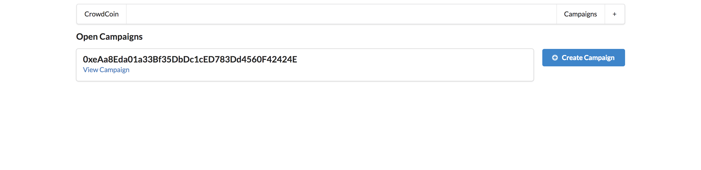
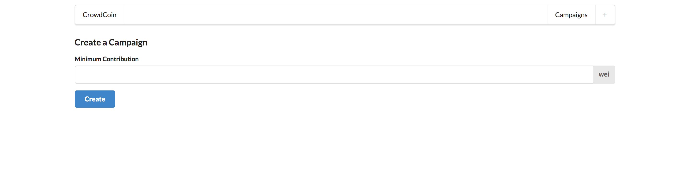
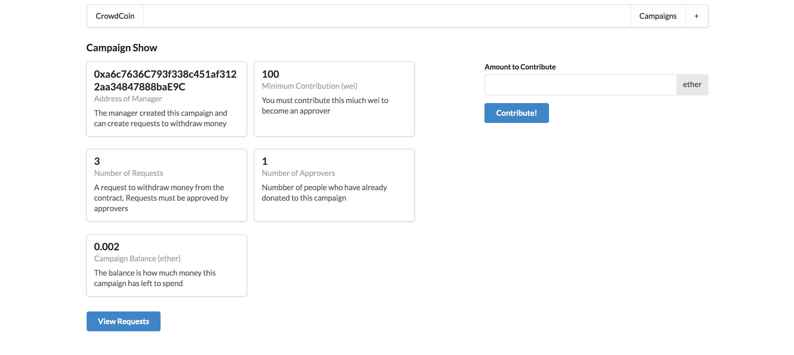
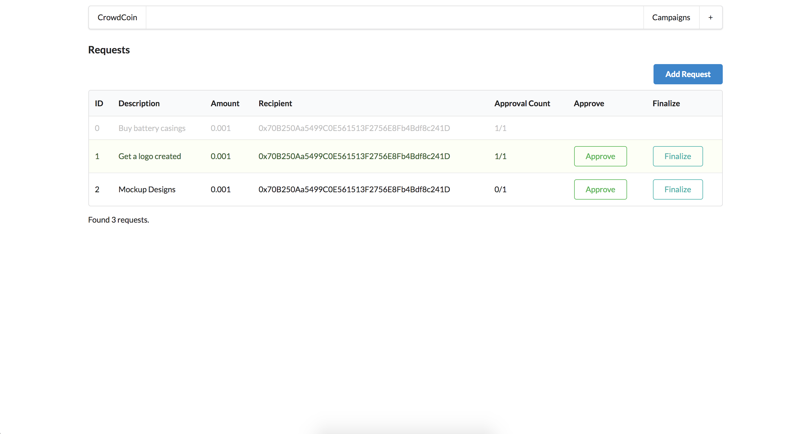

# Kickstart


Will need [Metamask](https://metamask.io/ "Meta Mask") chrome extension installed to contribute and approve requests.

To start this project:  

```
npm run dev
```

All Campaigns


Create a Campaign


Showing a particular Campaign


Showing all requests in a Campaign
